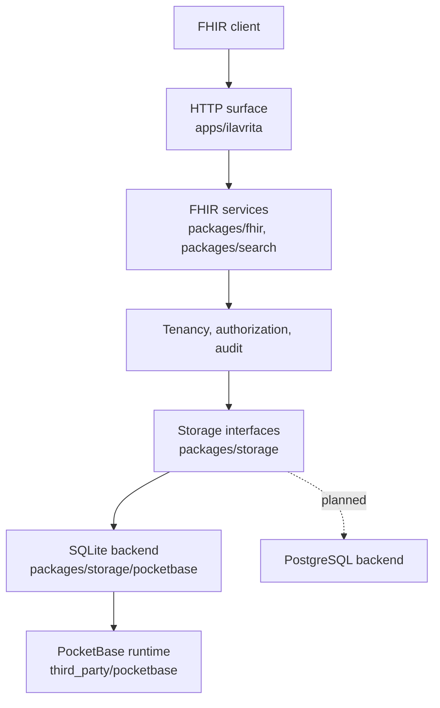

<p align="center">
  
</p>

<h1 align="center">Ilavrita</h1>

<p align="center">
  <strong>Open healthcare infrastructure. FHIR-native, self-hostable, edge to enterprise.</strong>
</p>

<p align="center">
  <a href="https://github.com/Ilavrita/Ilavrita/actions/workflows/ci.yml"></a>
  <a href="https://github.com/Ilavrita/Ilavrita/actions/workflows/codeql.yml"></a>
  <a href="LICENSE"></a>
  <a href="https://app.fossa.com/projects/git%2Bgithub.com%2FIlavrita%2FIlavrita?ref=badge_shield"></a>
  <a href="https://golang.org"></a>
  <a href="https://hl7.org/fhir/R4/"></a>
</p>

---

> [!IMPORTANT]
> **Ilavrita serves FHIR R4 today, and is not ready for patient data.**
>
> The by-key interactions, search, authorization, audit and payload storage are
> implemented and tested across 126 resource types. What is missing is listed
> below and in [docs/known-limitations.md](docs/known-limitations.md); the
> CapabilityStatement advertises only what the routes actually serve, because a
> server must never claim behaviour it has not implemented and tested.
>
> **Do not put patient data in this build yet.** Not because the boundaries are
> absent — they are enforced and tested — but because:
>
> - **Nothing checks a resource against a profile or a terminology.** The R4
>   base definitions are embedded and seeded, and every write is checked against
>   the one for its type — undeclared elements, missing required ones,
>   cardinality, choice types and primitive syntax are all refused. What is not
>   checked is a binding: `"status": "banana"` passes, so this server will still
>   keep a clinically nonsensical record.
> - **There is no migration story** beyond the schema this build applies to its
>   own database at startup. Backup and restore exist; upgrading between
>   releases is what does not.
> - **Nothing here has been through an external security review or an official
>   FHIR conformance suite.** The tests are ours.

> Picking this up cold? Start with [HANDOFF.md](HANDOFF.md) — what works, what does
> not, and the traps that are invisible from the code.

## Contents

- [Why Ilavrita](#why-ilavrita)
- [What works today](#what-works-today)
- [Quick start](#quick-start)
- [The API](#the-api)
- [Architecture](#architecture)
- [Repository layout](#repository-layout)
- [Development](#development)
- [Project setup](#project-setup)
- [Security and compliance](#security-and-compliance)
- [Licensing](#licensing)

## Why Ilavrita

Healthcare teams rebuild the same primitives every time: clinical resources,
version history, search, validation, access control, audit, file handling and a
safe way to deploy. Every team that builds them again spends months not building
their actual product, and arrives at slightly different interoperability
behaviour. Ilavrita exists so that work is done once, in the open.

Many of those teams also need something far smaller than a distributed
application stack. A clinic, a pilot, a device-adjacent service or a local
development environment should not require an external database to run a
standards-compliant FHIR server.

Ilavrita targets both ends: a single binary with SQLite for small deployments,
and an architecture that does not have to be rewritten to reach a clustered one.

## What works today

| Capability | State |
| --- | --- |
| `GET /healthz`, `GET /version` | Working |
| `GET /fhir/R4/metadata` | Working — advertises exactly what the routes serve |
| FHIR create, read, update, delete, history, vread | Working, 126 resource types |
| FHIR search | Working — `GET` and `POST /_search`, over a declared parameter set |
| Project isolation and authorization | Enforced — compartments, element filters, field restriction |
| Audit trail | Working — every interaction and login, in the transaction that did it |
| Authentication | Working — password, sessions, TOTP second factor with an administrator recovery path, per-install throttle |
| Binary payloads | Working — bytes stored outside the database |
| Subscriptions | Working — `rest-hook`, and `websocket` within one process; queues are claimed, so replicas do not notify twice |
| Resource validation, `$validate` | Against the R4 base definitions — no profiles, no terminology bindings |
| Bundle batch and transaction | Not implemented |
| Conditional create, update and delete | Not implemented |
| Backup and restore | Working — `ilavrita backup`, `verify-backup`, `restore` |
| Whole-system history | Not implemented |
| PostgreSQL, SMART, Bulk Data, HL7v2, DICOM | Out of scope for v0.1 |

Search is deliberately narrow: every parameter is a projection a write maintains
and a predicate a read compiles, so `packages/search/registry.go` lists what is
actually answered rather than what R4 defines. A parameter outside it is refused
with `400`, never ignored — a search that silently drops a criterion returns more
than it was asked for, and the caller cannot tell.

[docs/known-limitations.md](docs/known-limitations.md) is the authoritative list,
and [ROADMAP.md](ROADMAP.md) is the order things arrive in.

## Quick start

Requires **Go 1.27+**, and **Node 22+ with pnpm 10+** for the workspace tooling.

```bash
git clone https://github.com/Ilavrita/Ilavrita.git
cd Ilavrita
make bootstrap
make run
```

`make bootstrap` fetches the pinned PocketBase fork. **A plain clone without
submodules will not compile** — `go.mod` replaces PocketBase with
`third_party/pocketbase`, and that directory has to exist.

### Container

```bash
docker compose up --build
```

Images are published per release for `linux/amd64` and `linux/arm64` with build
provenance attached:

```bash
docker run --rm -p 8090:8090 -v ilavrita-data:/data ghcr.io/ilavrita/ilavrita:latest
```

## The API

```console
$ curl -s http://127.0.0.1:8090/healthz
{"status":"ok"}

$ curl -s http://127.0.0.1:8090/version
{"version":"dev","revision":"unknown","fhirVersion":"4.0.1"}
```

`GET /version` reports the commit the binary was built from, which is how a
running instance is matched to a source tag and a release artefact.

```console
$ curl -s -H 'Accept: application/fhir+json' http://127.0.0.1:8090/fhir/R4/metadata
{
  "resourceType": "CapabilityStatement",
  "status": "draft",
  "kind": "instance",
  "fhirVersion": "4.0.1",
  "format": ["application/fhir+json"],
  "software": {"name": "Ilavrita", "version": "dev"},
  "rest": [{
    "mode": "server",
    "resource": [
      {
        "type": "Patient",
        "interaction": [
          {"code": "create"}, {"code": "read"}, {"code": "update"},
          {"code": "delete"}, {"code": "history-instance"}, {"code": "vread"},
          {"code": "search-type"}
        ],
        "searchParam": [
          {"name": "_id", "type": "token"}, {"name": "_lastUpdated", "type": "date"},
          {"name": "identifier", "type": "token"}, {"name": "family", "type": "string"},
          {"name": "given", "type": "string"}, {"name": "gender", "type": "token"},
          {"name": "active", "type": "token"}, {"name": "birthdate", "type": "date"}
        ],
        "operation": [{"name": "validate", "definition": "..."}],
        "versioning": "versioned",
        "updateCreate": true
      }
    ]
  }]
}
```

`rest[].resource` carries 126 entries, one per declared type. A resource appears
there only once the conformance suite covers every status and header rule for it,
and the statement is generated from the routes that were actually registered — so
it cannot name something this build does not serve.

Every FHIR route requires an authenticated principal:

```console
$ curl -s -i http://127.0.0.1:8090/fhir/R4/Patient/123 | head -2
HTTP/1.1 401 Unauthorized
Content-Type: application/fhir+json
```

```json
{
  "resourceType": "OperationOutcome",
  "issue": [{
    "severity": "error",
    "code": "login",
    "diagnostics": "This request carries no authenticated principal."
  }]
}
```

A type the statement does not declare answers `404` on every route, and an
interaction this build does not implement answers `501` — always as an
`OperationOutcome`, never a framework error:

```console
$ curl -s -i http://127.0.0.1:8090/fhir/R4/Appointment/123 | head -1
HTTP/1.1 404 Not Found

$ curl -s -i http://127.0.0.1:8090/fhir/R4/Patient/_history | head -1
HTTP/1.1 501 Not Implemented
```

The HTTP surface is described in [`api/openapi.yaml`](api/openapi.yaml) and CI
checks that description against a live server on every change. See
[docs/api.md](docs/api.md) for why both OpenAPI and CapabilityStatement exist and
which to trust.

## Architecture

PocketBase is the runtime foundation. It is not the product, and it is not the
public contract.

Everything Ilavrita publishes — routes, error shapes, search semantics,
versioning, tenancy and authorization — belongs to Ilavrita and sits behind its
own interfaces. That indirection is why a PostgreSQL backend can be added later
without rewriting FHIR behaviour, and why a client written against Ilavrita today
keeps working when storage changes underneath it.



Four rules hold the layering together, and the first is enforced by a `depguard`
rule in [`.golangci.yml`](.golangci.yml) rather than by convention:

1. **Only `packages/storage/pocketbase` imports the PocketBase runtime.**
2. **No SQL above the storage backend.** Higher layers reason in FHIR terms.
3. **No PocketBase concept reaches `/fhir/R4`** — not a collection name, not an
   admin route, not an error shape. PocketBase's own API (`/api`) and admin
   console (`/_`) are disabled unless `ILAVRITA_EXPOSE_POCKETBASE=true`.
4. **Never advertise what is not implemented.** If the CapabilityStatement says a
   resource is supported, a test proves it.

[docs/architecture.md](docs/architecture.md) covers the search pipeline,
transaction boundaries and the tenancy model. The reasoning behind the big
decisions is in [docs/adr](docs/adr).

## Repository layout

```
apps/ilavrita              the server binary
apps/console               operator console (not implemented)
apps/docs                  documentation site (not implemented)

packages/fhir              FHIR R4 types published at the boundary
packages/search            query parsing and planning
packages/storage           the persistence interfaces services depend on
packages/storage/pocketbase  SQLite backend — the only package that may import PocketBase
packages/project           Project isolation boundary
packages/authz             authorization decisions
packages/audit             security event records
packages/files             Binary and DocumentReference payload storage
packages/config            runtime configuration
packages/observability     logging, correlation, health
packages/sdk-typescript    TypeScript client

api/openapi.yaml           HTTP surface description
third_party/pocketbase     the pinned Ilavrita PocketBase fork
```

## Development

```bash
make build        # compile the server
make test         # Go tests
make lint         # golangci-lint
make fmt          # format
pnpm build        # everything, through Turborepo
```

### API description

```bash
make api-lint     # valid OpenAPI 3.1
make api-verify   # description matches a running server
make api-docs     # render docs/api.html
```

### Running CI locally

[`act`](https://github.com/nektos/act) runs the workflows on your machine:

```bash
brew install act
make ci-local
```

`make ci-image` builds the runner image act uses. The stock act image loses
`node` from `PATH` once `actions/setup-go` runs, which breaks every JavaScript
action after it; [`build/docker/act-runner.Dockerfile`](build/docker/act-runner.Dockerfile)
fixes that so local runs match CI.

### Changelog

[CHANGELOG.md](CHANGELOG.md) is generated from commit history by
[git-cliff](https://git-cliff.org). Never hand-edit it:

```bash
make changelog
```

This is why commits are single-line [Conventional Commits](https://www.conventionalcommits.org).
A vague subject line becomes a vague changelog.

## Project setup

| Area | Where |
| --- | --- |
| Contributing | [CONTRIBUTING.md](CONTRIBUTING.md) |
| Code of conduct | [CODE_OF_CONDUCT.md](CODE_OF_CONDUCT.md) |
| Governance | [GOVERNANCE.md](GOVERNANCE.md) |
| Getting help | [SUPPORT.md](SUPPORT.md) |
| Branch protection | [docs/branch-protection.md](docs/branch-protection.md) |
| Release process | [docs/releasing.md](docs/releasing.md) |

Branches are `feature → dev → main → tag`. Releases are cut from `main` only, and
the release workflow refuses a tag whose commit is not an ancestor of
`origin/main`. Protection rules are versioned as JSON in
[.github/rulesets](.github/rulesets) so a change to who can push where is
reviewed like any other change.

Pull requests are labelled automatically by area and size.

## Security and compliance

Report vulnerabilities through [SECURITY.md](SECURITY.md), never a public issue.

[docs/security.md](docs/security.md) describes the controls and says for each one
whether it is enforced today. Project isolation, authorization, privilege
separation, authentication, audit and the rules around deleted data are enforced
and tested. Request correlation is not implemented, and TLS is a deployment
concern.

**Nothing here has had an external security review.** The tests are ours, and
that is the reason to keep patient data out of this build — not an absent
boundary.

Releases are signed and attested — container images with Cosign plus build
provenance and an SBOM bound to the digest, npm packages with npm provenance.
[docs/supply-chain.md](docs/supply-chain.md) has the verification commands.

Dependencies are scanned by CodeQL, GitHub dependency review and FOSSA. Findings
are reviewed and recorded in [docs/license-compliance.md](docs/license-compliance.md)
rather than silently ignored.

**The FOSSA licence check is red, and is an open work queue** — not something the
green engineering checks cover. Two questions are genuinely open: whether
`modernc.org/libc`'s glibc-derived headers affect the planned commercial licence,
which needs legal review rather than a scanner, and CVE-2023-36308 in a transitive
dependency with no fixed version. The rest are believed to be scanner artefacts.
That page carries the live count and the date it was read; this one deliberately
does not, because a number here would be stale the week after it was written.

> Ilavrita holds no certification, and running it does not make an organisation
> compliant with HIPAA, GDPR, EHDS or any other regime. It provides technical
> controls. Compliance is a property of your deployment, your policies and your
> organisation.

## Licensing

AGPL-3.0-only — see [LICENSE](LICENSE). A commercial option is planned but its
terms are not final; see [COMMERCIAL-LICENSE.md](COMMERCIAL-LICENSE.md).

Ilavrita builds on [PocketBase](https://github.com/pocketbase/pocketbase) (MIT),
whose notice is preserved at [LICENSES/PocketBase-MIT.txt](LICENSES/PocketBase-MIT.txt).
Per-dependency attribution is in [THIRD_PARTY_NOTICES.md](THIRD_PARTY_NOTICES.md).

The Ilavrita name and marks are not covered by the AGPL; see
[assets/brand/README.md](assets/brand/README.md).
