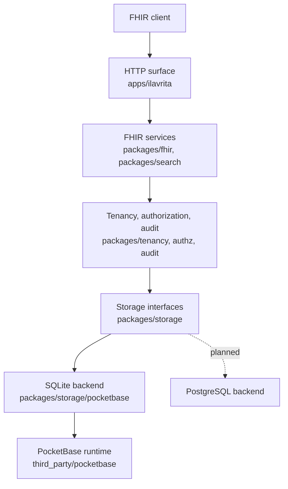

# Architecture

## The one thing that matters

PocketBase is the runtime foundation. It is not the product, and it is not the
public contract.

Everything Ilavrita publishes — routes, error shapes, search semantics,
versioning, tenancy and authorization — belongs to Ilavrita and sits behind its
own interfaces. That separation is the reason a PostgreSQL backend can be added
later without rewriting FHIR behaviour, and the reason a client written against
Ilavrita today keeps working when the storage layer changes.

## Layers



Dependencies point downward only. Nothing above `packages/storage` knows which
backend is in use, and nothing below it knows about FHIR.

## Rules the layering depends on

1. **Only `packages/storage/pocketbase` imports the PocketBase runtime.** This is
   enforced by a `depguard` rule in `.golangci.yml`, not by convention alone.
2. **No SQL above the storage backend.** Higher layers reason in FHIR terms:
   resource type, search parameter, modifier. SQL is a detail of one backend.
3. **No PocketBase concept reaches `/fhir/R4`.** Not a collection name, not an
   admin route, not an error shape. Failures are translated to
   `OperationOutcome`.

   This is enforced at the process level too: PocketBase's own REST API (`/api`)
   and admin console (`/_`) are disabled unless `ILAVRITA_EXPOSE_POCKETBASE=true`.
   Registering our routes on its router is not enough — the runtime registers its
   own, and they would otherwise be served alongside ours.
4. **Administrative and FHIR surfaces are separate.** Different routes,
   different authorization policies.

## Search

Search is where a FHIR server usually goes wrong, both in correctness and in
performance, so it gets an explicit pipeline rather than ad-hoc query building:

```
query string -> parser -> search AST -> SearchParameter registry
             -> tenant and authorization predicates -> planner
             -> backend query compiler -> searchset Bundle
```

Two consequences follow. Authorization predicates join the query plan rather
than filtering results in memory afterwards, and supported parameters are served
by typed indexes rather than by scanning resource JSON.

## Data integrity

A successful mutation commits the canonical resource, its immutable version, its
search indexes, its file references and its audit record together. A failure
before commit leaves nothing visible.

Search indexes are derived data. They are physically separate from the canonical
JSON and can be rebuilt from it, so losing an index costs a reindex, never a
resource.

## Tenancy

Every canonical resource, version, index entry, file reference and audit record
carries a tenant boundary that the server derives. It is never read from a
client-supplied FHIR field, and it is applied in the query layer rather than
after results are fetched.

Cross-tenant exposure of health data is the worst failure this system can have,
which is why the boundary lives in storage rather than in each service.

## Current state

Only the HTTP surface exists. `packages/storage` defines interfaces with no
implementation, and the FHIR services are package outlines. See
[known limitations](known-limitations.md).
